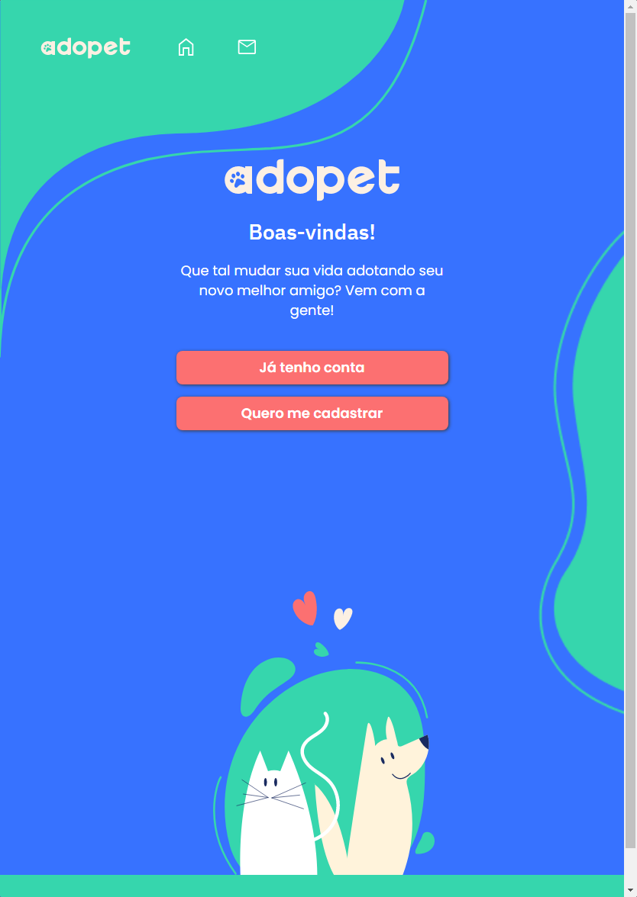
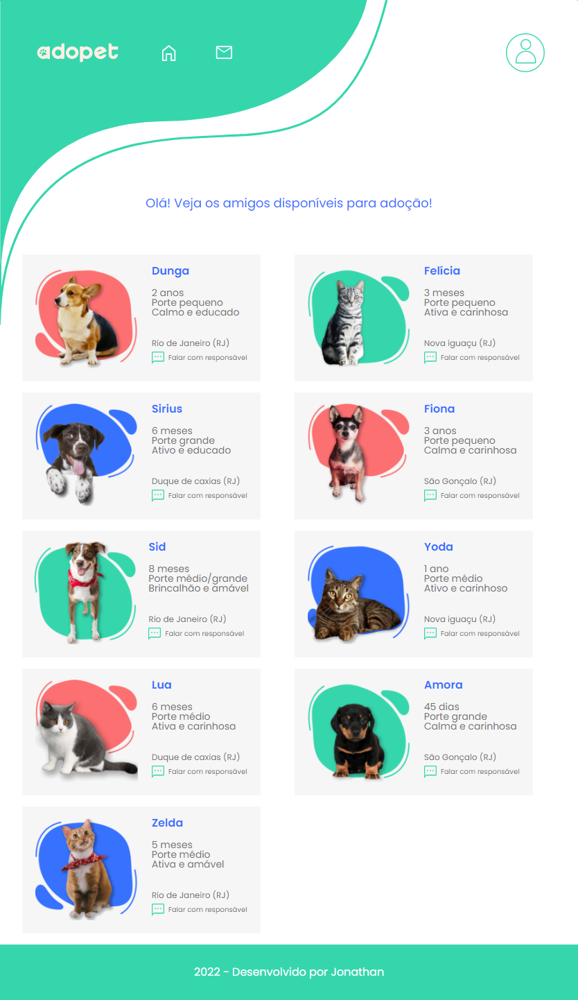

# Adopet

 Projeto desenvolvido na 4° edição do challenge front end da Alura
 
 - Descrição do projeto:  Página fictícia de uma central para adoção de pets.  
 - Seções disponíveis: Tela inicial | Cadastro | Login | Home | Mensagem | Perfil usuário
 - Projeto feito nas seguintes resoluções: 360px - Mobile | 760px - Tablet | 1440px Desktop
 - Tecnologias utilizadas: HMTL e CSS
 
 ## Tela inicial
  

### Login
  

### Cadastro
  

### Adoção
  

### Perfil
  

### Projeto
- Você pode acessar o projeto através do link: https://adopet-liard.vercel.app/